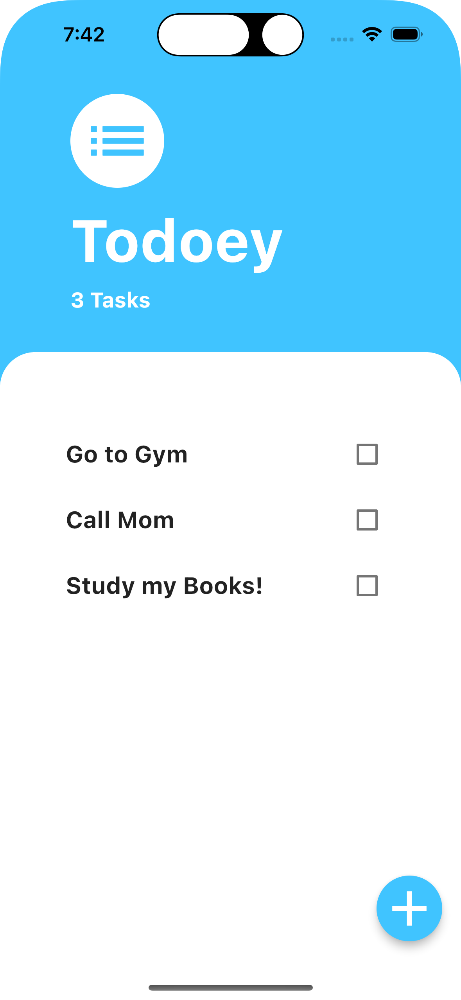
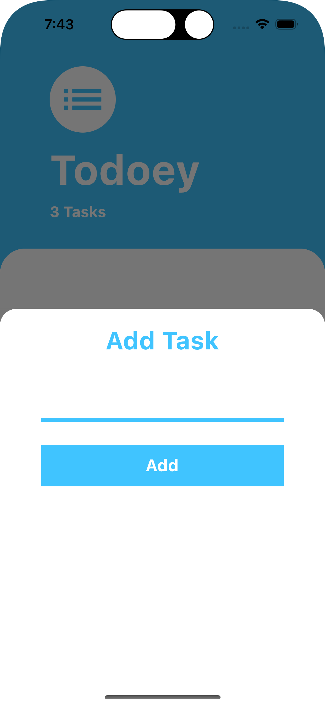
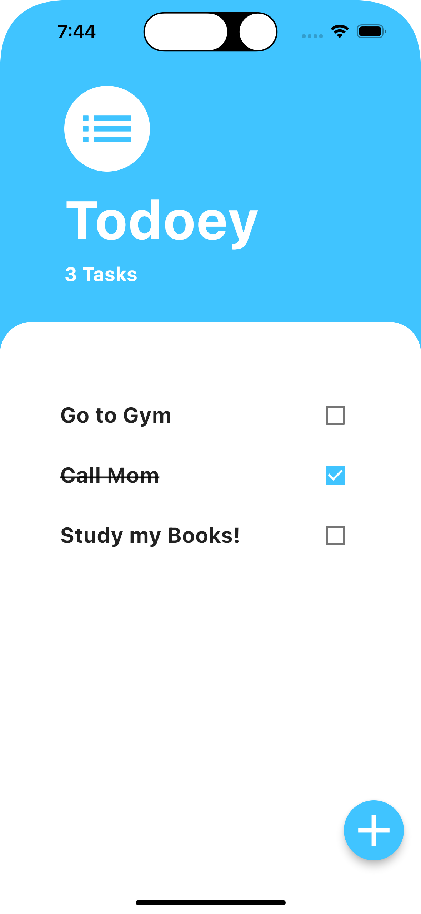

# todoey

Todoey App is a mobile app that allows a user to keep track of all their tasks.

## App Functionalities

- Add a task
- Delete a task
- Mark a task as done
- Mark a task as not done
- See total tasks count

## Building this App

- I Understood what is state and why we need to manage it.
- Understood the difference between ephemeral (local) state and app state.
- See the problems with simply relying on setState().
- Learn about the concept of Prop Drilling.
- Examine various popular ways of managing app state for Flutter projects.
- Learn about the List Builder.
- Use the Flutter BottomSheet Widget.
- Learn to lift state up to be able to access it from children widgets.
- Learn about design patterns and why they are useful.
- Understand how the Provider package works and use it to manage app state.

## App Screenshots

